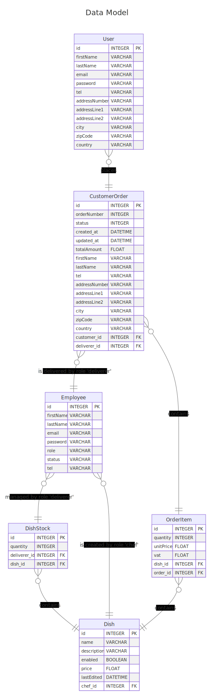

Projet 4 UML Express Food
> Chaque jour, ExpressFood élabore 2 plats et 2 desserts à son QG avec l'aide de chefs expérimentés. Ces plats sont conditionnés à froid puis transmis à des livreurs à domicile qui "maraudent" ensuite dans les rues en attendant une livraison. Dès qu'un client a commandé, l'un des livreurs (qui possède déjà les plats dans un sac) est missionné pour livrer en moins de 20 minutes.

> Sur son application, ExpressFood propose à ses clients de commander un ou plusieurs plats et desserts. Les frais de livraison sont gratuits. Les plats changent chaque jour.

> Une fois la commande passée, le client a accès à une page lui indiquant si un livreur a pris sa commande et le temps estimé avant livraison.

> ExpressFood a besoin que vous conceviez sa base de données. Il s'agit de stocker notamment :

- La liste des clients
- La liste des différents plats du jour
- La liste des livreurs, avec leur statut (libre, en cours de livraison) et leur position
- La liste des commandes passées
- ...

> Pour structurer votre réflexion vous utiliserez UML et construirez une suite de diagrammes afin de modéliser les besoins de l’application et le diagramme de classe pour modéliser les entités de l'application. Une fois que les diagrammes vous satisferont, vous réaliserez le schéma de base de données MySQL correspondant puis vous remplirez la base avec des premières valeurs fictives.

> Vous veillerez à produire des schémas UML cohérents par rapport au cahier des charges et respectant les standards UML. Vous concevrez ensuite un schéma de base de données SQL adéquat.

`Schémas demandés :`
 -  Diagrammes de cas d’utilisations (création d’une commande, ajout d’un plat du jour, livraison d’une commande)
 - Modèle de données
 - Diagramme de classes
 - Diagrammes de séquences (création d’une commande, ajout d’un plat du jour, livraison d’une commande).

# Diagrams
## Use Case Diagrams
---
> ### Use Case 1 - Dish Management
---

---
> ### Use Case 2 - Stock Management
---

---
> ### Use Case 3 - Order Creation
---

---
> ### Use Case 4 - Order Delivery
---

---
> ### Class Diagram
---

---
> ### DataModel Diagram
---

---
## Sequences Diagrams
---
---
> ### Sequence 1 - Dish Management Sequence Diagram
---

---
> ### Sequence 2 - Stock Management Sequence Diagram
---

---
> ### Sequence 3 - Order Creation Sequence Diagram
---

---
> ### Sequence 4 - Order Delivery Sequence Diagram
---
